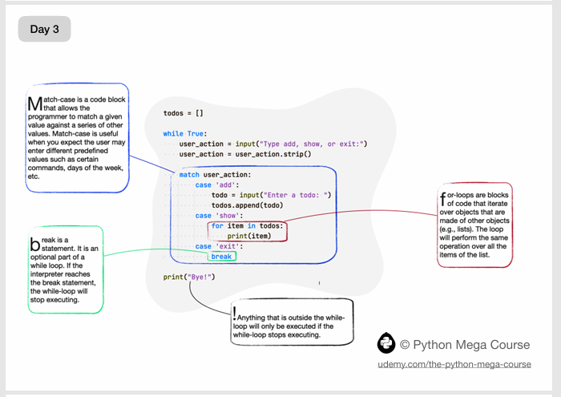
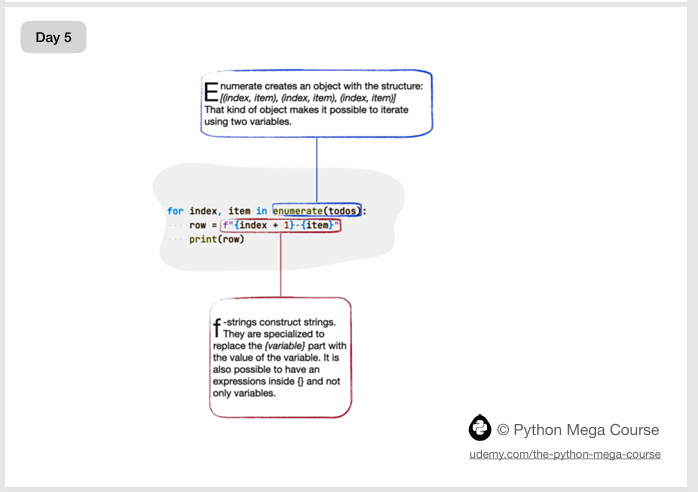
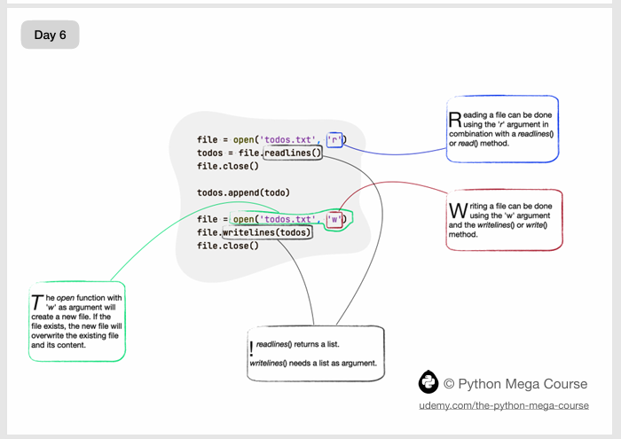
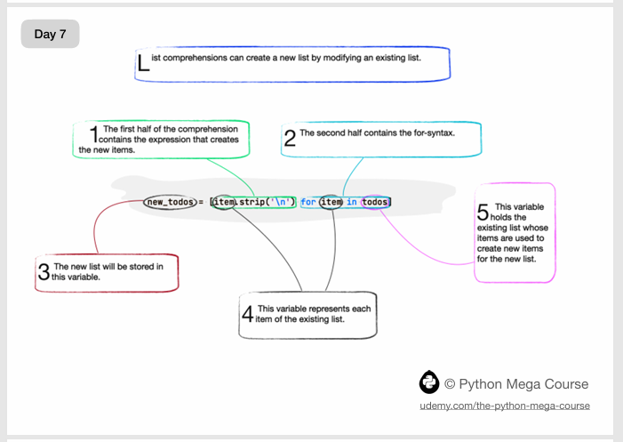
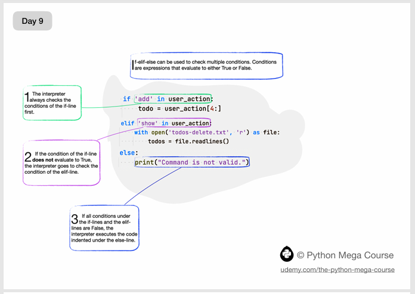
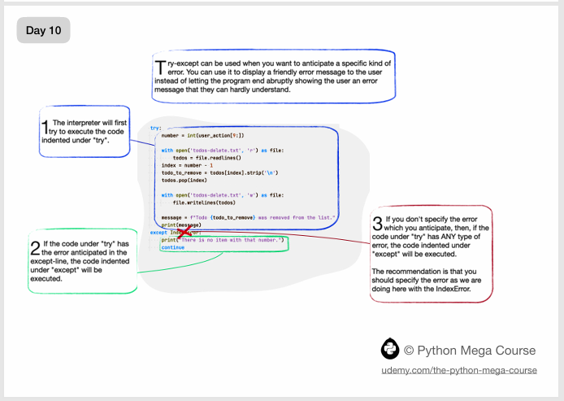
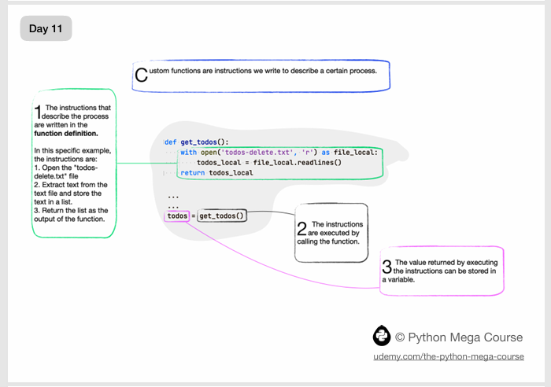
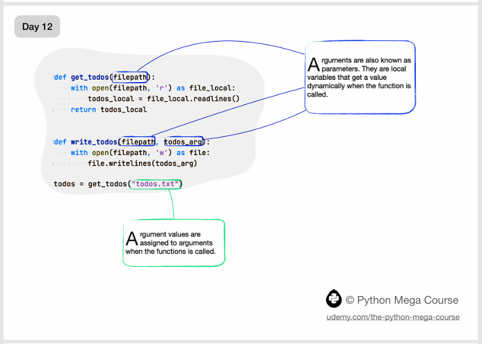

 # Python-60Days-Challenge

## -A TO Z Glossary For python: 
[Download the manual](docs/A+to+Z+Glossary.pdf)

## -DAY 1:

## -DAY 2:

## -DAY 3:

## -DAY 4:

## -DAY 5:

## -DAY 6:

## -DAY 7:

## -DAY 8:

## -DAY 9:

## -DAY 10:

## -DAY 11:

## -DAY 12:

